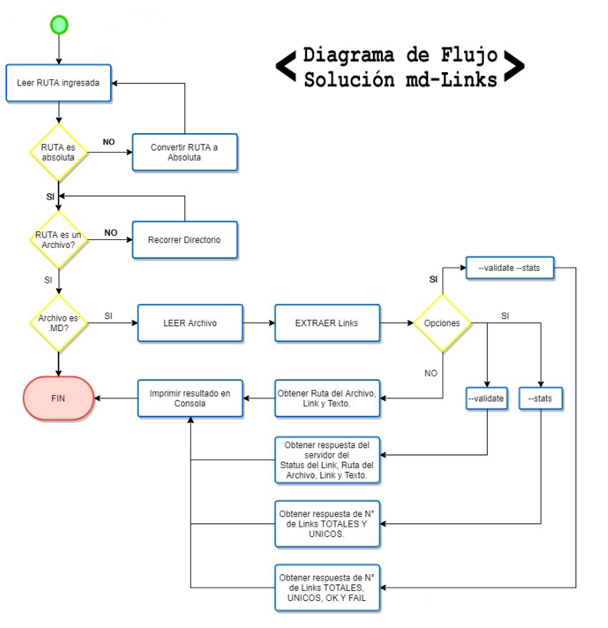
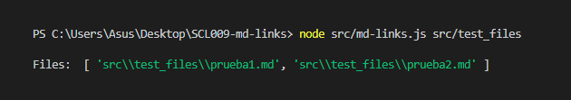
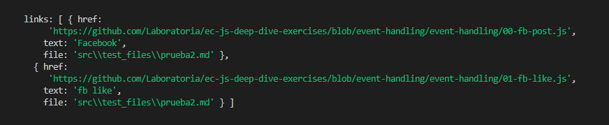
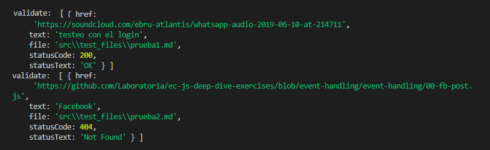
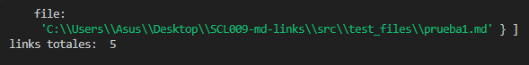

# at-md-links 
**version 0.0.1**

<br>
Es un modulo de node, que te permite extraer links de archivos en formato markdown, además de comprobar el estado en el que se encuentran, (ok o break).

## Flujo


## instalación  ⚙️🔧

Para instalar el modulo de md-link en tu proyecto, usa en tu terminal el siguiente comando.

```
npm install at-md-links
```
<br>
Y exporta el modulo a tu proyecto de la siguiente manera:

```
const mdLinks = require("at-md-links");
```

## Modo de uso 📌

Su uso es simple. Para hacer uso de esta herramienta, debes escribir en la terminal:

<br>

```
md-links <path-to-file>
```
_Donde "path" es la ruta donde se encuentra el archivo a analizar._

Se imprimirá en la terminal, las carpetas encontradas en la ruta, los links contenidos dentro del o los archivos .md.
<br>
### imprimiendo carpetas

<br>
### imprimiendo links contenidos en archivos

<br>

Para saber el estado en que se encuentran las url.
```
md-links <path-to-file> --validate
```
<br>



<br>
Para saber la cantidad de links encotrados en el archivo

```
md-links <path-to-file> --status
```
<br>




## Dependencias 📋
* deploy: ^1.0.3
* eslint: ^6.0.1
* filehound: ^1.17.0
* jest: ^24.8.0
* link: ^0.1.5
* marked: ^0.6.2
* node-fetch: ^2.6.

## Autora ✒️
* **Agatha Sáez**

